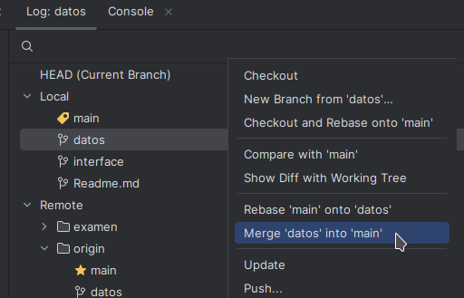
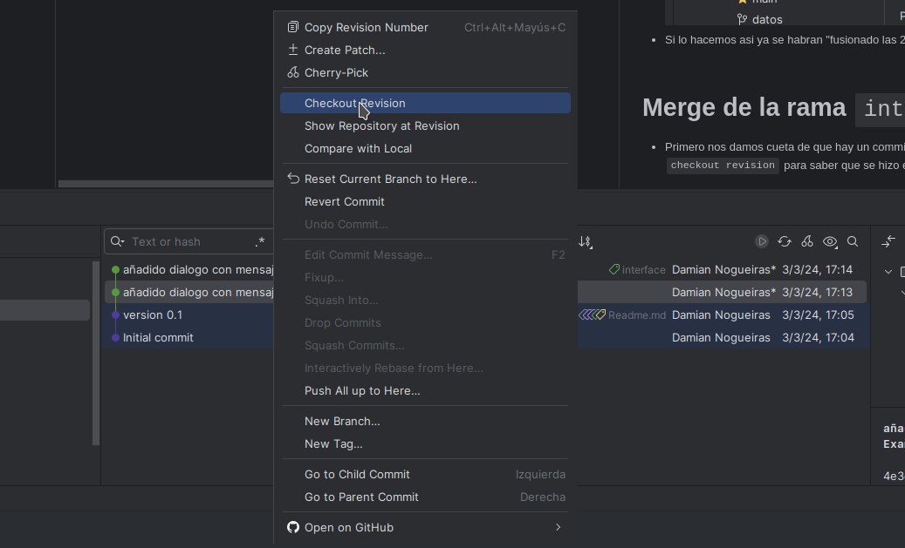
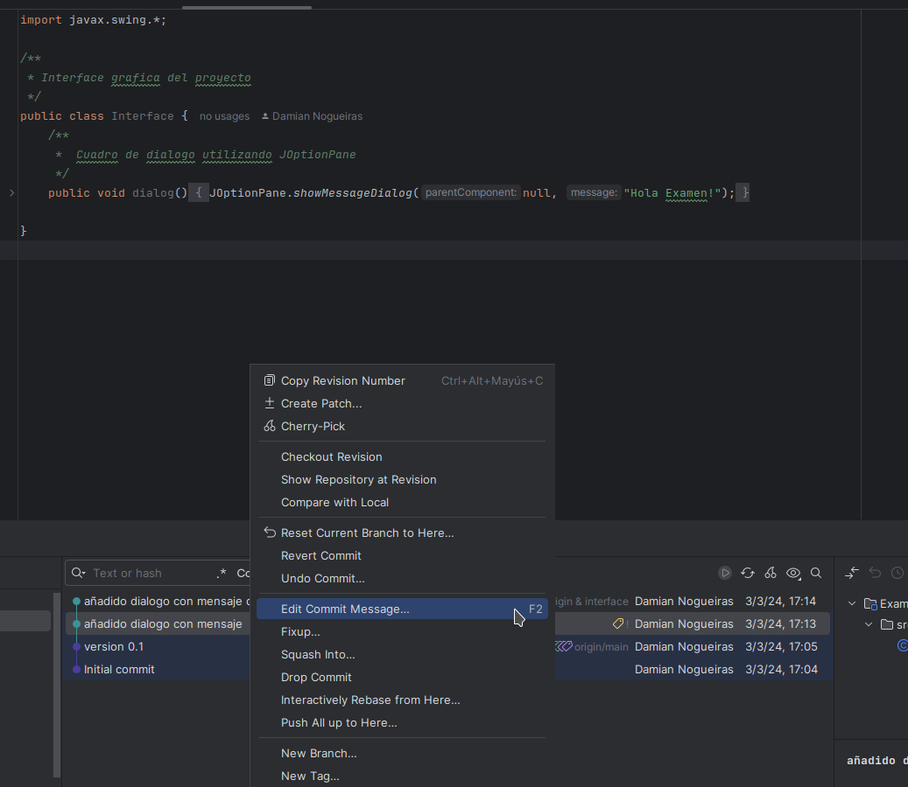
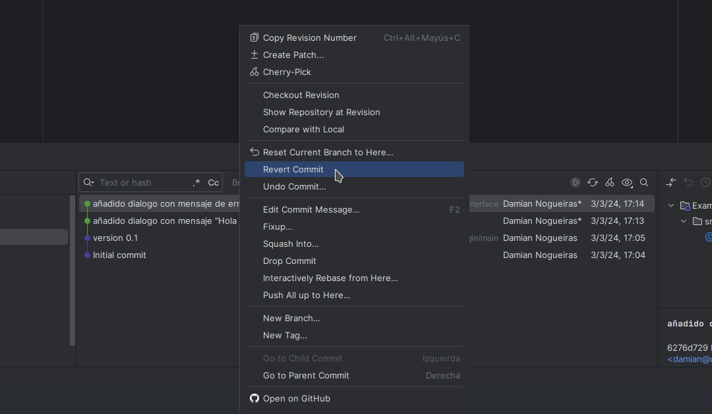
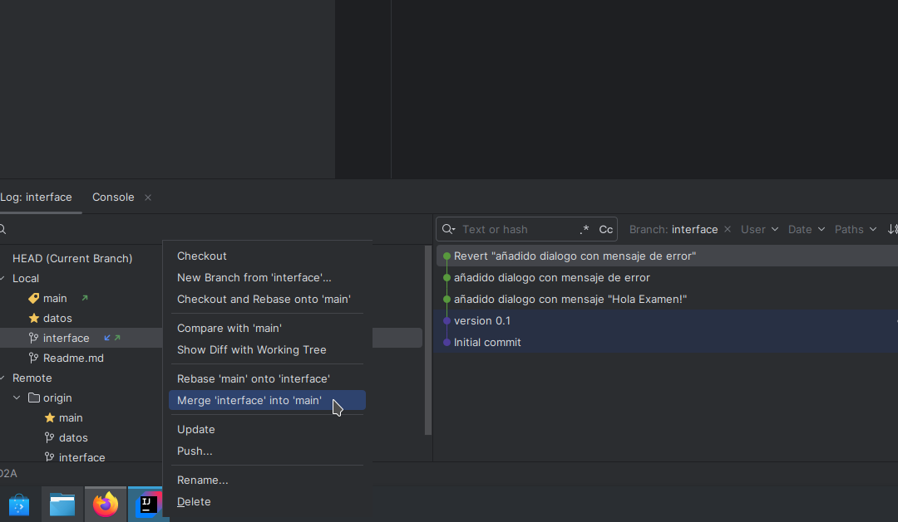

# Merge de la rama `datos`
* Hacemos `checkout` en la rama `main`
* Con click derecho en la rama `datos` seleccionamos la opcion de realizar un merge

* Si lo hacemos asi ya se habran "fusionado las 2 ramas"

# Merge de la rama `interface`
* Primero nos damos cueta de que hay un commit con un mensaje raro por lo que hacemos
  un `checkout revision` para saber que se hizo en ese commit.
  
* una vez verificado que se hizo hacemos un `checkout` a la rama `interface`
* Dentro de la rama click derecho en el commit que qeremos cambiar su mensaje
  seleccionamos la opcion de `Edti Commit Message`
  
* Le seleccionamos un nombre adecuado, por ejemplo _añadido dialogo con mensaje "Hola Examen!"_

* Ahora nos damos cuenta de que el ultimo commit contiene un error por lo que usaremos `revert commit`
 para no hacer un `merge` a ese error

* Y despues de eso ya podremos hacer un `checkout` a la main y hacerle `merge` a la rama `interfeace`
* 